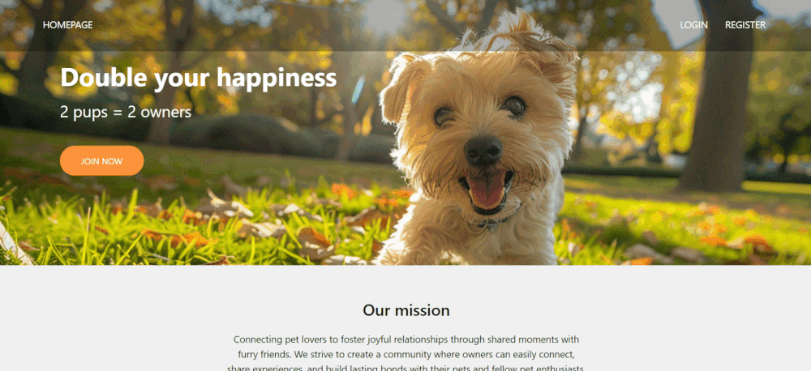

# 🐶 Dog Walking Companion App  
(University Code Lab Project – Database Integrations, Responsive Design)

## ✨ Features  
- Choose a walking buddy that matches your dog's preferences  
- View important owner details (e.g., age range, preferred walking partner gender) 

## App structure
Homepage: Introduces the website and its purpose. Login & Register options

Registration Page: Users create profiles & upload images

Login Page: Secure authentication

User Page: Setup dog profiles & preferences

Match Results Page: Shows matching dogs based on preferences

Browse Dogs Page: View all dogs with profile details

Dog Profile Page: Detailed info about selected dogs

Settings Page: Update account settings & delete account 

## Running the DogApp
1) Open 2 terminals
2) Navigate to project directories:
   
  -cd backend  
  
  -cd frontend  

In the backend:

  -npm install
  
  -node app.js
  
In the frontend:

  -npm run dev

## App screenshots

